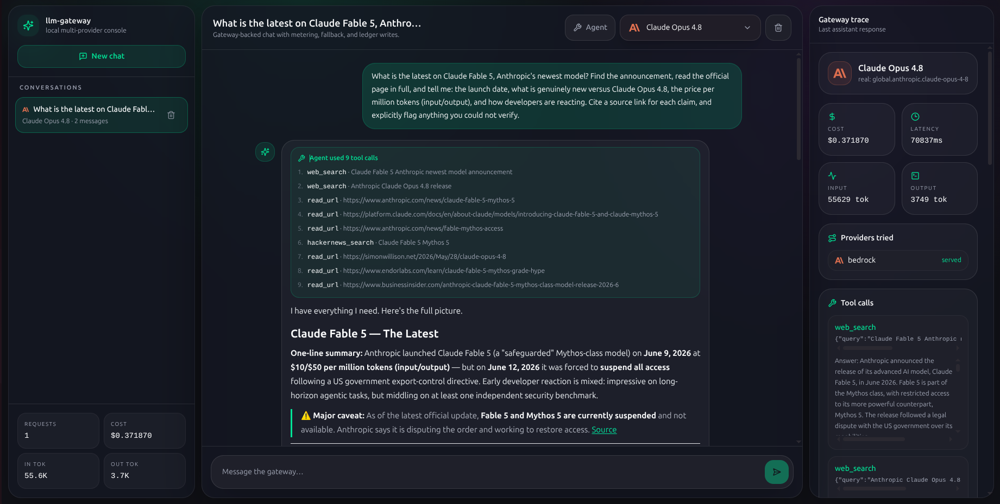
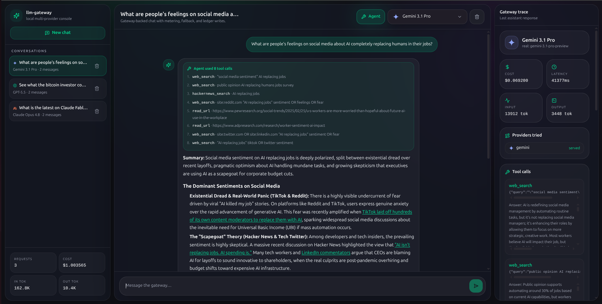
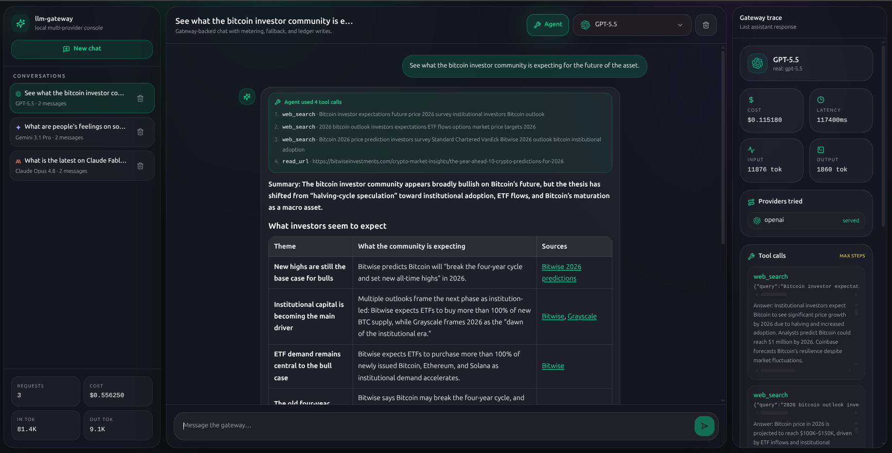
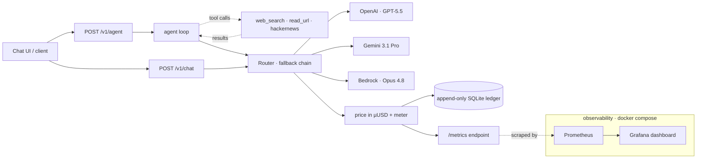
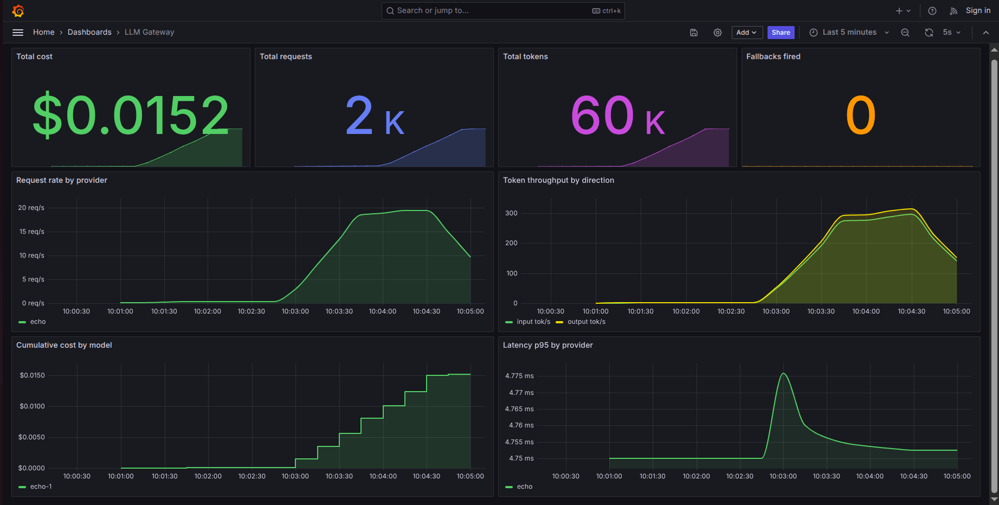

# llm-gateway

[](https://github.com/camposvinicius/llm-gateway/actions/workflows/ci.yml)
[](https://www.python.org/downloads/)
[](LICENSE)

A minimal multi-provider LLM gateway with per-token cost metering, an append-only usage ledger, fallback routing, Prometheus + Grafana observability, real OpenAI / Gemini / AWS Bedrock providers, unified tool-calling, and a web research agent.

> The goal is not to hide provider APIs behind a toy wrapper. The goal is to show the production plumbing every LLM platform eventually needs: routing, metering, reconciliation, fallback, tool-calling and observability.

## What it does

- **Multi-provider routing** with a configured fallback chain across `openai`, `gemini`, and `bedrock` (plus an offline `echo` provider for tests).
- **Real frontier models, served honestly.** The bundled chat UI's *Claude Opus 4.8 / Gemini 3.1 Pro / GPT-5.5* labels map to those exact models (`global.anthropic.claude-opus-4-8`, `gemini-3.1-pro-preview`, `gpt-5.5`) — all env-configured, with their real prices in the ledger.
- **Unified tool-calling.** One canonical request/response shape; the gateway translates it to each provider's native dialect (OpenAI `tool_calls`, Gemini `functionCall`, Bedrock `toolUse`) and back.
- **Web research agent** (`POST /v1/agent`): a metered tool-use loop with real tools — Tavily web search, Jina URL reader, and Hacker News.
- **Exact cost metering** using integer micro-USD — no floating point money.
- **Append-only SQLite ledger** recording successes and failures.
- **Prometheus metrics** for request count, tokens, cost, latency and fallback events — with a one-command **Grafana dashboard** (`docker compose up`).
- **FastAPI surface**: `POST /v1/chat`, `POST /v1/agent`, `GET /healthz`, `GET /metrics`.
- **Next.js chat UI** (`examples/chat_ui`): live model dropdown, gateway trace panel, and a Tool calls panel when Agent mode is on.

## See it in action

Three frontier models, each running the research agent against a live question.
The trace panel (right) confirms the real provider, model, route, tokens and cost;
the inline tool list shows exactly which tools the model chose to call.

**Claude Opus 4.8** — chains all three tools (`web_search` → `read_url` → `hackernews_search`) to dig up the latest on Claude Fable 5, then answers with a sourced summary and a caveat.



**Gemini 3.1 Pro** — searches and reads sources (`web_search` + `read_url`) to gauge social-media sentiment on AI, returning a structured breakdown by platform.



**GPT-5.5** — runs deliberate one-at-a-time `web_search` calls to survey the bitcoin investor community, then synthesizes a sourced comparison table.



## Architecture



Both endpoints flow through one **Router**: it walks the fallback chain until a
provider succeeds, then prices the call in integer micro-USD, appends it to the
ledger, and increments the Prometheus counters exposed at `/metrics`. The agent
loop sits *on top of* the router — every step it takes is a normal, metered model
call. The bundled observability stack (`docker compose up`) scrapes `/metrics` with
Prometheus and renders the Grafana dashboard shown under
[Metrics & dashboards](#metrics--dashboards).

## Why micro-USD?

Provider prices are usually quoted as USD per million tokens. The gateway stores cost as integer micro-USD, so the math becomes hand-checkable:

```text
cost_micro_usd = tokens × price_per_million_usd
```

Example: 1,000 input tokens at $3.00/M = 3,000 µUSD = $0.003000. Across millions of requests, integer arithmetic stays exact; floats do not.

## Quickstart (offline)

```bash
python3 -m venv .venv
.venv/bin/pip install -e ".[dev]"

GATEWAY_PROVIDERS=echo \
GATEWAY_PRICING_FILE=data/pricing.example.json \
GATEWAY_LEDGER_PATH=/tmp/llm-gateway.db \
.venv/bin/uvicorn gateway.app:app --host 127.0.0.1 --port 8080
```

Request:

```bash
curl -s http://127.0.0.1:8080/v1/chat \
  -H 'content-type: application/json' \
  -d '{"messages":[{"role":"user","content":"hello gateway"}]}' | jq
```

Response shape:

```json
{
  "id": "...",
  "provider": "echo",
  "model": "echo-1",
  "text": "echo: hello gateway",
  "usage": {"input_tokens": 2, "output_tokens": 3},
  "cost": {"micro_usd": 1400},
  "routing": {"providers_tried": ["echo"]}
}
```

Inspect the ledger:

```bash
.venv/bin/gateway-report summary --ledger /tmp/llm-gateway.db
```

## Bedrock

```bash
export GATEWAY_PROVIDERS=bedrock,echo
export GATEWAY_BEDROCK_MODEL=<bedrock-model-id>
export GATEWAY_PRICING_FILE=data/pricing.bedrock.example.json
export GATEWAY_LEDGER_PATH=/tmp/llm-gateway-bedrock.db
# AWS credentials/region resolve through the standard AWS chain (AWS_PROFILE, AWS_REGION, instance role, etc.)

.venv/bin/uvicorn gateway.app:app --host 127.0.0.1 --port 8080
```

There is deliberately no default Bedrock model. Model choice affects cost and behavior, so it must be explicit.

## Providers & models

Everything is env-driven (`.env.example` has the full list). The defaults wire up
the three frontier models the chat UI advertises:

| UI label | `GATEWAY_*_MODEL` | Real model id |
| --- | --- | --- |
| Claude Opus 4.8 | `GATEWAY_BEDROCK_MODEL` | `global.anthropic.claude-opus-4-8` |
| Gemini 3.1 Pro | `GATEWAY_GEMINI_MODEL` | `gemini-3.1-pro-preview` |
| GPT-5.5 | `GATEWAY_OPENAI_MODEL` | `gpt-5.5` |

A few real-world quirks the providers handle for you, so the same code serves old
and new models:

- **GPT-5.x are reasoning models.** They reject `temperature` and `max_tokens`; the
  OpenAI provider drops `temperature` and switches to `max_completion_tokens`
  (`GATEWAY_OPENAI_MAX_TOKENS`, default 4096) for any `gpt-5*`/`o*` model.
- **Claude 4.7+/Fable on Bedrock reject `temperature`.** The Bedrock provider omits
  it for those families so the request isn't rejected.
- **Gemini "thinking" models bill hidden reasoning.** The Gemini provider counts
  `thoughtsTokenCount` at the output rate so the ledger matches the real bill, and
  echoes back each tool call's `thoughtSignature` on multi-step round-trips.

## Tool calling & the research agent

`POST /v1/chat` accepts an optional `tools` array (canonical
`{name, description, input_schema}`) and returns `stop_reason` plus canonical
`tool_calls`. The gateway translates that one shape to each provider's native
format and back — including the awkward parts (OpenAI's separate `tool` messages,
Gemini's name-keyed `functionResponse` and required `thoughtSignature`, Bedrock's
`toolResult` blocks).

`POST /v1/agent` builds the loop on top: it calls the model with the registered
tools, runs whatever the model asks for, feeds results back, and repeats until the
model answers (or hits `max_steps`, after which it forces one final answer). Every
model call goes through the router, so each one is priced and written to the ledger
— the agent is a loop *on top of* the gateway, not a bypass around its metering.

```bash
curl -s http://127.0.0.1:8080/v1/agent \
  -H 'content-type: application/json' \
  -d '{"messages":[{"role":"user","content":"What is the latest news about Claude Opus?"}],
       "provider_chain":["bedrock"]}' | jq '.steps, .text, .cost'
```

### The tools

Three tools ship by default. Each is a small, self-contained file — a name, a JSON
Schema, and a `run(args) -> str` function ([`src/gateway/tools/`](src/gateway/tools)):

| Tool | Inputs | Backed by | Returns | Needs |
| --- | --- | --- | --- | --- |
| `web_search` | `query`, optional `max_results` (1–10, default 5) | [Tavily Search API](https://tavily.com) | A synthesized answer plus ranked results — title, URL and a ~300-char snippet each | `TAVILY_API_KEY` |
| `read_url` | `url` (absolute http/s) | [Jina Reader](https://jina.ai/reader) (`r.jina.ai`) | The page's main content as clean, LLM-friendly text, capped at 3,500 chars | nothing (`JINA_API_KEY` optional — raises rate limits) |
| `hackernews_search` | `query` | [Algolia Hacker News API](https://hn.algolia.com/api) | Top 5 matching stories with points, comment counts and links | nothing |

The three are designed to compose: `web_search` to find sources, `read_url` to read
a promising one in full, `hackernews_search` for developer sentiment and launch
chatter. That's exactly the chain in the [screenshots above](#see-it-in-action).

Tools register only when their prerequisites exist, so the agent degrades
gracefully — no Tavily key just means no `web_search`, while `read_url` and
`hackernews_search` keep working. `build_default_tools()` decides this at startup
from the environment.

A few deliberate choices behind them:

- **One shape, every provider.** A tool's JSON Schema is advertised to whichever
  provider answers, translated to that provider's native tool dialect — the same
  `web_search` works whether GPT-5.5, Gemini, or Opus is driving.
- **Failures don't abort the run.** A tool that errors returns an error *string*,
  not an exception, so the model can read it and recover (retry, reword, move on)
  instead of crashing the whole agent request.
- **Reads are capped at 3,500 chars on purpose.** The agent re-sends every prior
  tool result on each step, so an unbounded page dump would blow up context, cost
  and latency — especially on reasoning models.
- **Shared resilience.** Every tool's HTTP call reuses the gateway's retry policy
  (12 s timeout, exponential backoff with full jitter) — the same one the providers
  use.
- **Adding a tool is one file.** Drop a `name + schema + run()` into
  `src/gateway/tools/` and register it; the agent loop and all providers pick it up
  with zero other changes.

A thin CLI lives in [`examples/web_research_agent`](examples/web_research_agent).

## Chat UI

`examples/chat_ui` is a Next.js console for the gateway: pick a model, send a
prompt, and the trace panel shows the real provider, model, route, tokens, latency
and cost. Toggle **Agent** to enable the tools — the panel then lists every tool
call (name, arguments, result). The fastest way to run both together:

```bash
cp .env.example .env   # fill in OPENAI_API_KEY / GOOGLE_API_KEY / TAVILY_API_KEY / AWS creds
./scripts/run-local.sh # starts the gateway + UI with the premium models
```

Then open **<http://localhost:3000>** in your browser — that's the UI. It talks to
the gateway running at **<http://localhost:8080>** (override with `GATEWAY_PORT` /
`UI_PORT`). The screenshots above are exactly what you'll see.

## Metrics & dashboards

The gateway exposes Prometheus metrics at **`GET /metrics`** — a plain-text scrape
endpoint, not a UI (it deliberately doesn't bundle a dashboard; Prometheus and
Grafana are separate servers that scrape this endpoint and visualize it). View the
raw output anytime:

```bash
curl -s http://localhost:8080/metrics | grep ^gateway_
```

### What's measured

| Metric | Type | Labels | What it answers |
| --- | --- | --- | --- |
| `gateway_requests_total` | counter | `status`, `provider` | How many requests succeeded vs failed, and which provider served them. |
| `gateway_tokens_total` | counter | `model`, `direction` | Input vs output tokens per model — the raw basis for cost. |
| `gateway_cost_micro_usd_total` | counter | `model` | Spend per model, in integer micro-USD (÷ `1e6` for USD). |
| `gateway_fallbacks_total` | counter | `winner` | How often the fallback chain kicked in, and which provider ultimately answered. |
| `gateway_latency_ms` | histogram | `status`, `provider` | Per-provider latency distribution — the buckets give you p50/p95/p99. |

Counters only ever go up; you read them with `rate()` (per-second) or `increase()`
(per-window) in Prometheus. Cost is stored as an integer the whole way through, so
the numbers reconcile exactly with the SQLite ledger.

### Live dashboards (Prometheus + Grafana)

A self-contained stack is included so you can see real dashboards with one command —
no credentials required:

```bash
docker compose up --build   # or: docker-compose up --build
```

This builds the gateway in offline `echo` mode, runs a tiny load generator so the
charts have live data, and wires up Prometheus + Grafana with the dashboard below
already provisioned.



Then open:

| URL | What |
| --- | --- |
| <http://localhost:3001> | **Grafana** — the *LLM Gateway* dashboard, pre-loaded (no login) |
| <http://localhost:9090> | **Prometheus** — query the raw metrics / check scrape targets |
| <http://localhost:8080/metrics> | the gateway's raw exposition endpoint |

The dashboard turns those raw counters into the operational view you'd actually
watch in production:

- **Total cost / requests / tokens / fallbacks** — at-a-glance totals for the selected time window.
- **Request rate by provider** — `rate(gateway_requests_total[1m])` split by provider: how much load, and who's carrying it.
- **Token throughput by direction** — input vs output tokens/sec; output is the side you mostly pay for.
- **Cumulative cost by model** — running USD spend per model (`gateway_cost_micro_usd_total / 1e6`).
- **Latency p95 by provider** — `histogram_quantile(0.95, …)`: the tail latency users actually feel.

To scrape the gateway into your *own* Prometheus instead, point a job at it:

```yaml
# prometheus.yml
scrape_configs:
  - job_name: llm-gateway
    static_configs:
      - targets: ["localhost:8080"]
```

Dashboards convert µUSD to USD by dividing by `1e6`; the application keeps money as integers end to end.

## Design decisions

- **Unknown model pricing fails loud.** Serving a completion you cannot meter is a silent revenue leak.
- **Append-only ledger.** Rows are inserted, never updated or deleted. Corrections should be new rows, not history edits.
- **Failures are recorded too.** The ledger should answer operational questions like "how often did fallback fire?".
- **Echo provider for CI.** The gateway (and the agent loop) is testable offline with deterministic usage and cost — no credentials, no network.
- **Provider abstraction is tiny.** A provider is one class implementing `complete(messages, tools)`; the gateway normalizes tool-calling across all of them, so the router, ledger, agent, and UI never special-case a vendor.
- **No provider profile/account names in code.** Cloud credentials resolve through standard environment mechanisms.

## Project layout

```text
src/gateway/
  app.py                 # FastAPI app: /v1/chat, /v1/agent, /healthz, /metrics
  config.py              # env-driven settings
  factory.py             # builds router/providers/pricing/ledger
  pricing.py             # Decimal prices, integer micro-USD costs
  ledger.py              # append-only SQLite request ledger
  router.py              # fallback routing + metering
  messages.py            # canonical message/content (text, tool_use, tool_result)
  agent.py               # metered tool-use loop behind /v1/agent
  metrics.py             # Prometheus metrics
  cli.py                 # gateway-report summary
  providers/
    base.py              # Provider protocol + Completion + ToolCall
    echo.py              # deterministic offline provider
    openai.py            # OpenAI / OpenAI-compatible (incl. GPT-5.x reasoning models)
    gemini.py            # Google Gemini (Generative Language API)
    bedrock.py           # AWS Bedrock Converse provider
  tools/                 # web_search (Tavily), read_url (Jina), hackernews_search
examples/
  chat_ui/               # Next.js console with model dropdown + Tool calls panel
  web_research_agent/    # thin CLI over POST /v1/agent
deploy/
  prometheus/            # scrape config for the demo stack
  grafana/               # provisioned datasource + the LLM Gateway dashboard
Dockerfile               # gateway image (offline echo mode by default)
docker-compose.yml       # one-command gateway + loadgen + Prometheus + Grafana
```

## Roadmap

- Streaming responses (and streaming tool-call steps to the UI).
- Tenant/account ids and prepaid credit ledger.
- Idempotency keys for request replay safety.
- Postgres ledger backend.

## License

MIT
